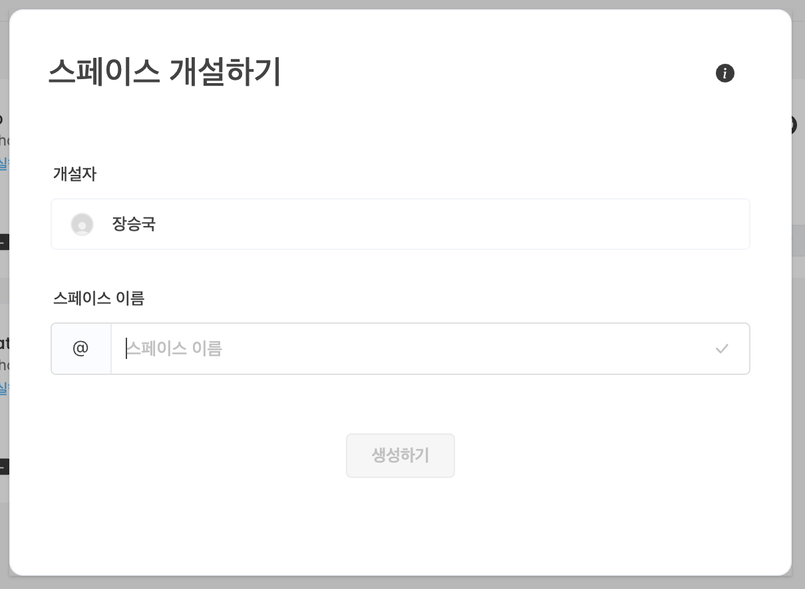
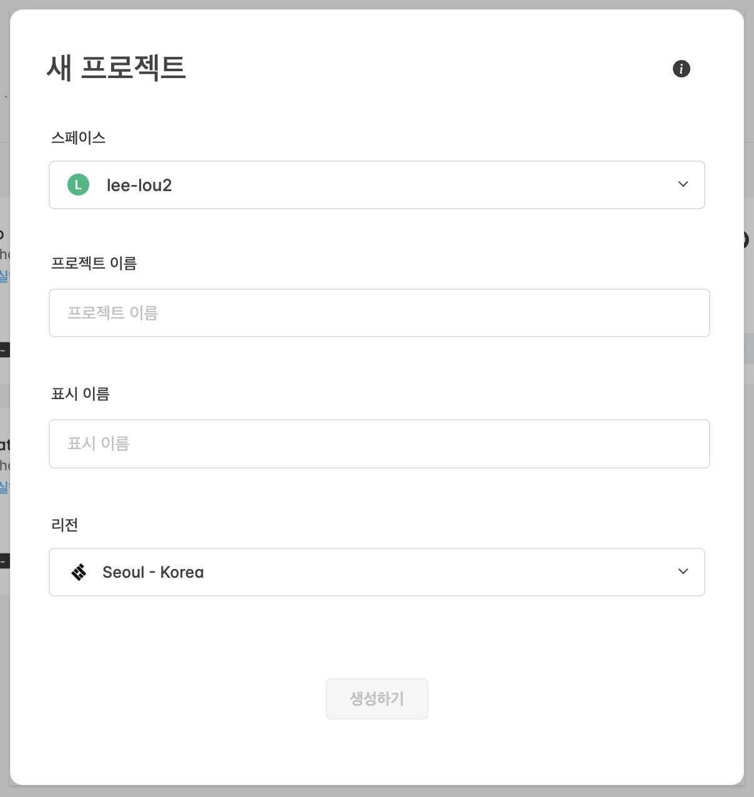
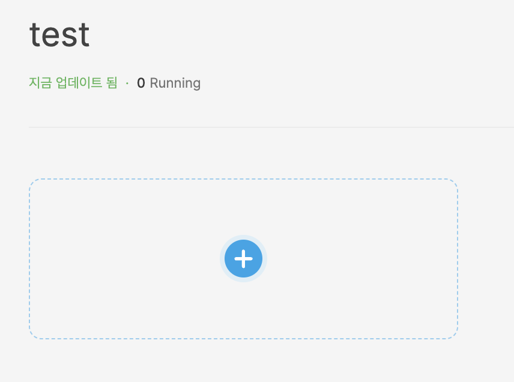
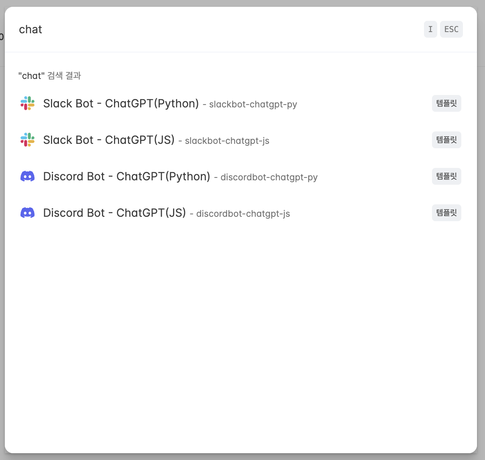
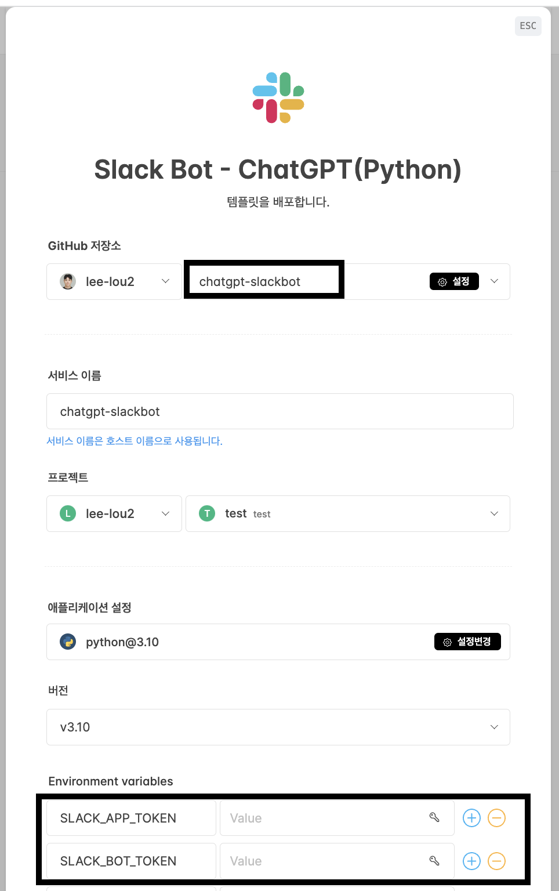
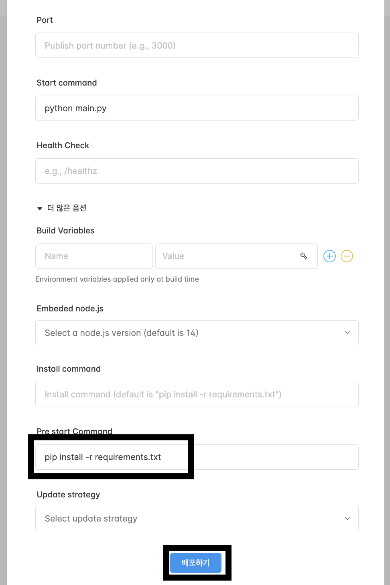
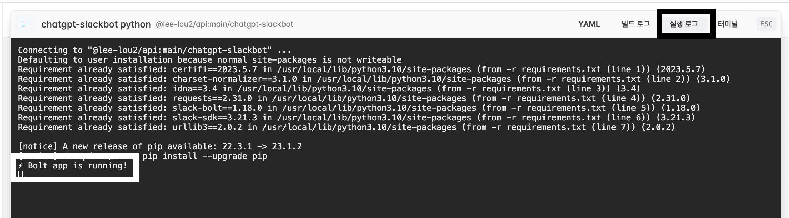
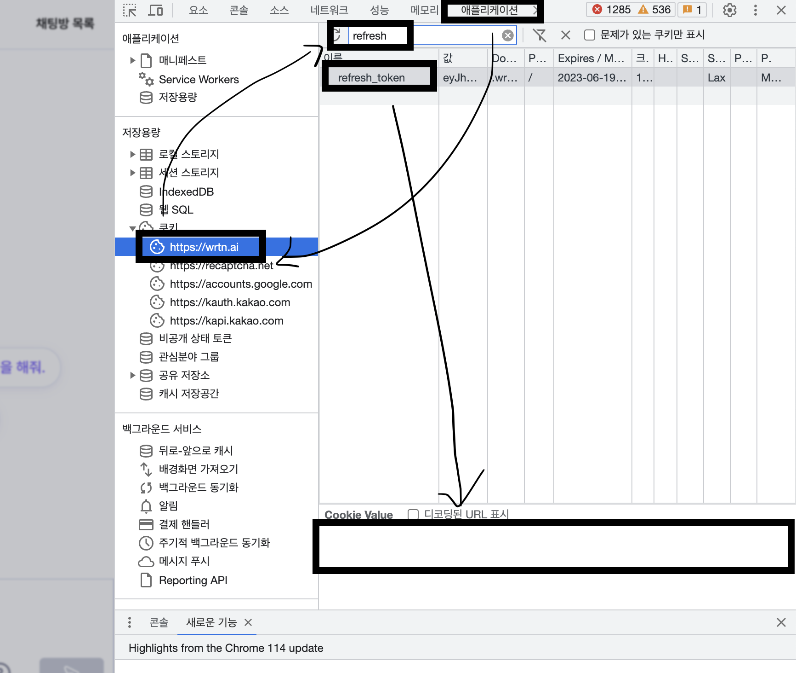
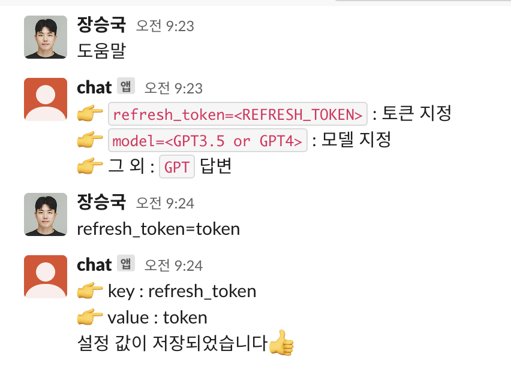

# 💬 무료 ChatGPT로 슬랙봇 생성

## 1. 슬랙 APP 생성

### 1.1 슬랙 APP 선택

👉 **'From scratch'** 선택


### 1.2 슬랙 APP 이름 설정

👉 **App Name** : 원하는 이름

👉 **Pick a workspace ...** : 생성을 희망하는 워크플로우 선택

👉 전체 입력 후 **'Create App'** 선택


### 1.3 Socket Mode 켜기

👉 **Connect using Socket Mode** : **On**

👉 **Token** : 슬랩 앱 토큰(아래 코드에서 'SLACK_APP_TOKEN' 으로 사용)


### 1.4 Event Subscriptions 설정

👉 **Enable Events** : On

👉 **Subscribe to bot events** : `message.channels` 추가


### 1.5 OAuth & Permissions 설정

👉 **Scopes** : `chat:write` 가 없는 경우 추가

👉 **Install to Workspace** : 클릭


### 1.6 앱 설치 및 Bot Token 확인

👉 **Bot User OAuth Token** : 복사 (이 토큰이 아래에서 'SLACK_BOT_TOKEN' 으로 사용)


## 2. 슬랙 봇 지정

### 2.1 슬랙 실행

👉 슬랙 워크스페이스에 접속

### 2.2 채널 생성


### 2.3 앱 추가


## 3. 슬랙봇 로컬 실행 코드(테스트)

```bash
$ git clone https://github.com/lee-lou2/chatgpt-slackbot

$ cd chatgpt-slackbot
$ pip install -r requirements.txt

$ export SLACK_APP_TOKEN="<위에서 저장한 코드>"
$ export SLACK_BOT_TOKEN="<위에서 저장한 코드>"

$ python main.py
```

## 4. 깃헙 Fork

👉 (계정이 없는 경우) 깃헙 가입

👉 레포지토리 Fork


## 5. 클라우드타입을 이용한 배포

👉 (계정이 없는 경우) 클라우드타입 가입

👉 스페이스 > 프로젝트 각각 생성




👉 어플리케이션 생성



👉 **'Slack Bot - ChatGPT(Python)'** 선택



👉 Github 연동 후 Fork 한 레포지토리 선택

👉 Environment Variables 에 위에서 획득한 키 입력



👉 **Pre start Command** 에 아래 코드 입력

```pip install -r requirements.txt```

👉 배포하기



👉 배포 확인




## 6. 뤼튼 가입 및 토큰 조회

### 6.1 뤼튼 가입

👉 [뤼튼 가입 하러가기](https://wrtn.ai/)

### 6.2 뤼튼 토큰 조회

👉 개발자 도구 켜기

👉 애플리케이션 > 쿠키 탭으로 이동

👉 검색창에 `refresh_token` 검색

👉 `refresh_token` 값 복사



## 7. 뤼튼 토큰 설정

👉 생성된 슬랙 채널에서 `refresh_token=<복사된_토큰>` 입력하여 데이터베이스 저장

## 8. 슬랙봇 사용

👉 `도움말` 입력시 간단한 설명 출력

👉 최초 실행시 `refresh_token=<REFRESH_TOKEN>` 입력 필요

👉 model 변경을 희망하는 경우 `model=<GPT3.5 or GPT4>` 입력 (기본값 : `GPT4`)


